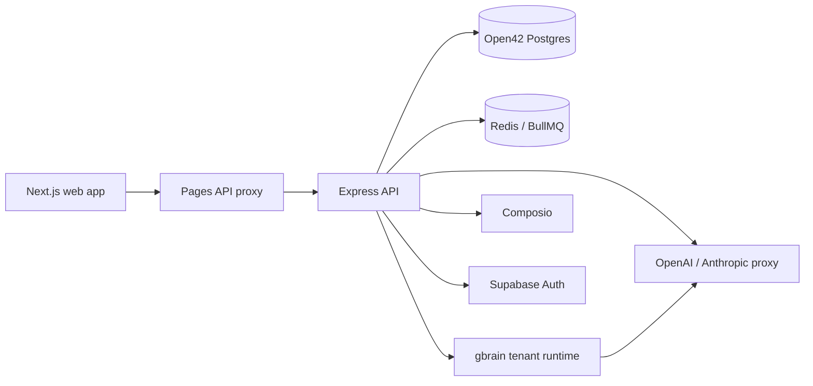

# System Overview

Open42 owns the product shell around gbrain: users, workspaces, connector setup,
ingest orchestration, chat, citations, skills, metadata, and deployment.
gbrain remains a separate runtime accessed through HTTP and MCP.

## Main Flows

| Flow | Implementation |
| --- | --- |
| Sign-in | `apps/api/src/routes/auth.ts` verifies Supabase identities and creates server-side sessions. |
| Workspace access | `requireMembership` and `requireRole` gate tenant-scoped routes through `memberships`. |
| Tenant provisioning | Workspace creation enqueues BullMQ jobs; the worker provisions gbrain, registers OAuth, stores encrypted credentials, and marks the workspace ready. |
| Connectors | Users connect Notion via Composio or upload Notion exports as zip files. |
| Ingest | The scheduler extracts connector docs, stages them on disk, submits a gbrain import job, polls completion, and commits connection cursors. |
| Chat | API queries gbrain, streams responses, records document citations, and exposes cited source chunks. |
| Skills | Users mint or revise Skill drafts from cited chat context; drafts are validated and stored in Postgres. |
| Provider egress | Tenant runtimes call Open42's OpenAI/Anthropic proxy with a tenant proxy token; Open42 resolves BYOK or allowed shared keys. |

## Persistence Boundaries

Open42 stores metadata in its own Postgres database. Tenant brain data is stored
inside each gbrain runtime. Open42 never stores raw provider keys in plaintext:
workspace credentials and gbrain OAuth secrets are encrypted before persistence.

## Build Boundaries

Community builds do not need Stripe or Fly dependencies. Cloud builds compile
`packages/cloud/api` to JavaScript and expose it through `@open42/cloud/api`.
The web build switches between real cloud pages and community stubs through a
Next webpack alias.
